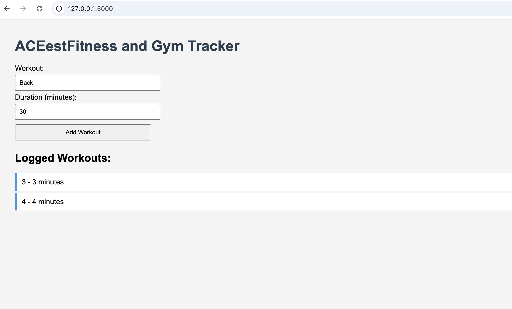
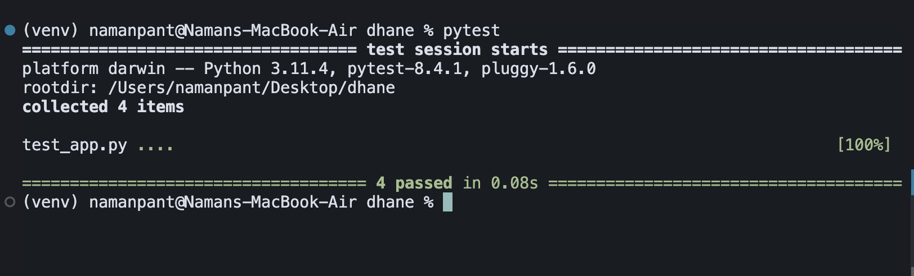

## Introduction to DevOps 
       (Merged - CSIZG514/SEZG514) (S1-25)
       
*Name*: **Harshad Dhane**
*ID*: **2024ht66510**
*Email*: **2024ht66510@wilp.bits-pilani.ac.in**

## Assignment Objective 
This assignment aims to provide students with hands-on experience in fundamental DevOps practices. By completing this assignment, students will gain proficiency in version control with Git and GitHub, containerization using Docker, and implementing continuous integration and continuous delivery (CI/CD) pipelines with GitHub Actions. 

## Problem statement
You are tasked with developing a robust and automated application for ACEest_Fitness and Gym, a burgeoning startup. As a Junior DevOps Engineer, your primary responsibility is to establish a streamlined development and deployment workflow that ensures code quality, consistency, and efficient delivery. Your solution should encompass the following key phases:
1.	Application Development
2.	Version Control System (VCS) Implementation
3.	Unit Testing Framework Integration
4.	Automated Testing Configuration
5.	Containerization with Docker
6.	CI/CD Pipeline with GitHub Actions

## Tools Used:
     > Flask 2.3.2
     > Python 3.13
     > Docker Engine 28.3.3
     > Nginx 1.29.1
     > Git 2.51.0
     > GitHub Desktop
     > Visual Studio code 1.103.2

## Important Notes:
There are two branches in this repository
####
     > Main
     > Master
All the codes are avalible and properly uploaded to the Master Branch
The Main Branch consists of Given Example code, along with Readme.md and ither misc files

  ⚠️ IMPORTANT: 
  ####
        > Workflow for Python App has been tested in Master Branch.
Navigate to : [.github/workflows/mail.yml](https://github.com/Harshad141/Fitapp/tree/master/.github/workflows)

## Problem statement deliverables:
__________________________________________________________________________________________________________________
## Step 1: 
#### Goal : Build a Flask web app for ACEest-Fitness
    > Use the code provided in ACEest-Fitness.py (in Main Branch)
    > Add a Flask structure to it and save it as app.py, example given below (in Master Branch)
    > Create a .txt file named requirements.txt
    Install Dependencies :
  ```python
  pip install -r requirements.txt
  ```
```python
# Code for app.py

from flask import Flask, render_template, request, redirect, url_for

app = Flask(__name__)

workouts = []

@app.route('/')

def indexhome():
return render_template('index.html', workouts=workouts)

@app.route('/add', methods=['POST'])

def add_workout():
workout = request.form.get('workout')
duration = request.form.get('duration')
if not workout or not duration:
return "Please enter both workout and duration.", 400
try:
   duration = int(duration)
   workouts.append({'workout': workout, 'duration': duration})
         return redirect(url_for('home'))
   except ValueError:
        return "Duration must be a number.", 400

if __name__ == '__main__':
   app.run(debug=True)
```
Run the Flask Application:
```bash
python app.py
```
By default, Flask runs on http://localhost:5000. Open this URL in your browser to access the application.
####Output:

__________________________________________________________________________________________________________________
## Step 2: 
#### Goal : Version Control Implementation
Use the below steps to push the file to a remote Github Repository
```python
1 git init
2 git add .
3 git commit -m "Initial commit to the Fitness app"
4 git remote add origin htttps://github.com/harshad141/fitapp.git
5 git push -u origin master
```
__________________________________________________________________________________________________________________
## Step 3:
#### Goal: Unit Testing Framework Integration

To validate the functionality of the Flask application we use Pytest, use the below code with 4 test cases.
The code is also avalible in app_test.py in Master Branch

```python
import pytest
from jinja2 import DictLoader
from app import app as flask_app, workouts
@pytest.fixture(autouse=True)
def _setup_app_and_reset_workouts():
    # Use testing mode and inject a template
    flask_app.config.update(TESTING=True)
    flask_app.jinja_loader = DictLoader({"index.html": TEMPLATE})

    # Clear global state before each test
    workouts.clear()
    yield
    workouts.clear()

@pytest.fixture()
def client():
    with flask_app.test_client() as c:
        yield c

def test_home_renders_empty_list(client):
    resp = client.get("/")
    assert resp.status_code == 200
    html = resp.get_data(as_text=True)
    assert '<span id="count">0</span>' in html
    # No list items yet
    assert 'class="workout"' not in html
def test_add_workout_missing_workout_returns_400(client):
    resp = client.post("/add", data={"duration": "20"})
    assert resp.status_code == 400
    assert b"Please enter both workout and duration." in resp.data

def test_add_workout_missing_duration_returns_400(client):
    resp = client.post("/add", data={"workout": "Cycling"})
    assert resp.status_code == 400
    assert b"Please enter both workout and duration." in resp.data

def test_add_workout_non_numeric_duration_returns_400(client):
    resp = client.post("/add", data={"workout": "Yoga", "duration": "abc"})
    assert resp.status_code == 400
    assert b"Duration must be a number." in resp.data
```
__________________________________________________________________________________________________________________
## Step 4:
#### Goal: Automated Testing Configuration
To run successful script, open the project directory in your local VS Code Editor and run this code
Open terminal and use :
```python
pytest
```
Confirm all tests pass locally before CI setup.

Output:

__________________________________________________________________________________________________________________
## Step 5:
#### Goal: Containerization with Docker
The goal here is to package the application for a containerised deployment.
Steps are given below:

1. Create a docker file: DockerFile (Avalible in venv/Dockerfile in the main branch)
```python

FROM python:3.10-slim
WORKDIR /app
COPY . .
RUN pip install -r requirements.txt
EXPOSE 5000
CMD ["python", "app.py"]
```
2. Login to Docker
```python
Docker login
```
3. Build and Run
```python

docker build -t aceest_fitness .
docker run -p 5000:5000 aceest_fitness
```
4. Run the contianrised application
   > The application will be live on http://127.0.0.1:5000
   > If it throws an port error, try different port after editing the above script
```python

docker build -t aceest_fitness .
docker run -p 5000:5050 aceest_fitness
```
   > The appliation will be live on http://127.0.0.1:5050
__________________________________________________________________________________________________________________
## Step 6
#### Goal: CI/CD Pipeline with GitHub Actions
Follow the below steps

1. Master Branch, add a file in .github/workflows/mail.yml
2. Add the Follwoing code in Mail.yml File

```python
name: Python Tests

on:
  push:
    branches:
      - main
  pull_request:
    branches:
      - main

jobs:
  test:
    runs-on: ubuntu-latest

    steps:
      - name: Checkout code
        uses: actions/checkout@v3

      - name: Set up Python
        uses: actions/setup-python@v4
        with:
          python-version: '3.10'

      - name: Install dependencies
        run: |
          pip install -r requirements.txt

      - name: Run tests
        run: |
          pytest
```
4. If your workflow is triggered by a pull request, GitHub will show a status check on the PR:

✅ All checks passed

❌ Some checks failed


5. Workflow Run Status
   
Success (✔️): All jobs and steps completed without errors.

Failure (❌): One or more steps failed.

Cancelled (🚫): The workflow was manually stopped.


This can be seen in the Actions tab of the repository.

